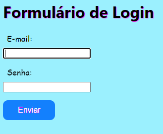

# indice

* [Form-Login](#form-CadEcommerce)
* [Descrição](#descrição)
* [Introdução](#introdução)
* [Sites Consultados](#Sites-consultados)
* [Funcionalidades](#funcionalidades)
* [Tecnologias Utilidades](#tecnologias-utilizadas)
* [Autores](#autores)

## Descrição 📖
-  Este projeto consiste em um formulário de login que solicita ao usuário seu e-mail e senha para autenticação. O formulário foi desenvolvido utilizando HTML e CSS, e possui validação de campos para garantir a correta entrada de dados. Após o preenchimento correto dos campos, o usuário pode realizar o login no sistema.

## Introdução 📄
Preenchimento de dados em um formulário de Login

## Fontes consultados 📱
- [boot strap](https://getbootstrap.com/)

## Funcionalidades 🧠⚙️
 Aprender a construir uma tabela de formulário de Login em HTML5

## Tecnologias Utilizadas 🖥️  
- Visual Studio Code;
- CSS3;
- HTML5;
- Github;
- Boot Strap
- Git

## Autores 👥📘
- [Murilo Tonassi](https://github.com/murilo-tonassi)
- [naillim novaski](https://github.com/naillimnovaski)
- [Nicolas Tonassi](https://github.com/nicolas-tonassi)

 